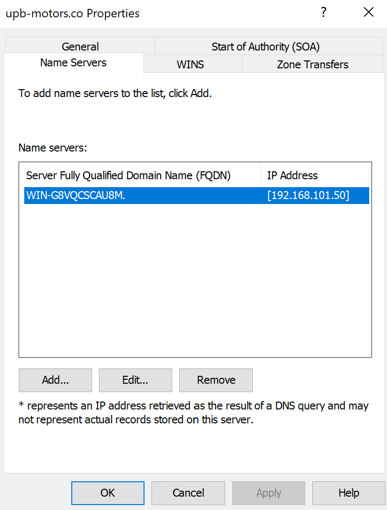
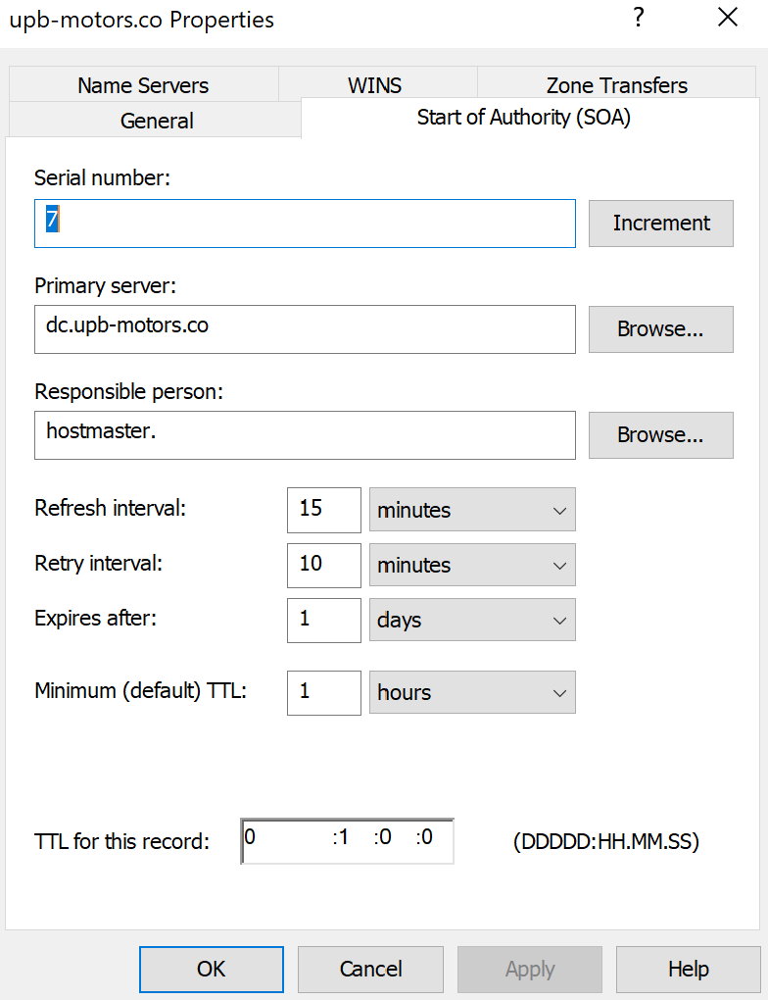

# Setup

## IPs

| Machine name | Network           | IP                | Default gateway | DNS server     |
| ------------ | ----------------- | ----------------- | --------------- | -------------- |
| WS-1         | 192.168.101.48/29 | 192.168.101.50    | 192.168.101.49  | 192.168.101.50 |
| WS-2         |                   |                   |                 |                |
| Deb-1        | 192.168.101.56/29 | 192.168.101.58    | 192.168.101.57  | 192.168.101.50 |
| Employees    | 192.168.101.32/28 | 192.168.101.34-46 | 192.168.101.33  | 192.168.101.50 |


## IPs with Domains

| Machine name | Service             | OS       | Domain            | Running IP      |
| ------------ | ------------------- | -------- | ----------------- | --------------- |
| WS-1         | FTP/FTPS            | Windows  | ftp.upb-motors.co | 192.168.101.50  |
| WS-1         | Primary DNS         | Windows  | dc.upb-motors.co  | 192.168.101.50  |
| WS-2         | Secondary DNS       | Windows? |                   | ?               |
| WS-2         | HTTP Reverse Proxy  | Windows? |                   | ?               |
| Deb-1        | All email services? | Debian?  |                   | 192.168.101.58? |
| Deb-1        | HTTP/HTTPS          | Debian   | www.upb-motors.co | 192.168.101.58  |
| Deb-1?       | VoIP                | Debian?  |                   | 192.168.101.58  |

## Default Emails

| User       | Domain        |
| ---------- | ------------- |
| aplicacion | upb-motors.co |
| admin      | upb-motors.co |
| gerente    | upb-motors.co |
| inventario | upb-motors.co |
| rh         | upb-motors.co |
| ventas     | upb-motors.co |

## Production

### FTP(S)

Using Windows server.

1. Add roles and features


2. Installation Type `Role-bases`


3. Web server (IIS)


4. Disable all and enable `FTP`


5. `Open Server Manager >Tools > Internet Information Services (IIS) Manager`


6. FTP Firewall support


7. Set configuration and apply


8. Add ports to firewall inbound rules


9. Create SSL certificate.

```powershell
New-SelfSignedCertificate -FriendlyName "selfsigned-upb-motors" -CertStoreLocation cert:\localmachine\my -DnsName upb-motors.com
```


10. Serve folder in FTP


11. Serve folder in FTPS


### HTTP(S)

#### Setup container

Install docker in the operating system.

1. Update `config.json`:

2. Build the image:

```shell
docker build -t upb-motors:latest /path/to/repository
```

3. Create the container:

```shell
docker create -p 80:80 -p 443:443 --restart unless-stopped --name upb-motors-production upb-motors:latest
```

4. Start the container:

```shell
docker start upb-motors-production
```

### Primary DNS

Using Windows Server.

1. Add roles and features


2. Installation Type `Role-bases`


3. DNS server


4. Confirmation and install


4. `Open Server Manager >Tools > DNS`


5. Select server


6. New zone


7. Primary zone


8. Forward lookup zone


9. Zone name


10. Zone file


11. No Dynamic updates


12. New Reverse lookup zone


13. Rename nameserver





#### Services Domains

##### HTTP/HTTPS

1. New Host **A**


2. `www` name


##### FTP/FTPS

1. `ftp` name


##### All mail services

##### Domain Controller


### Secondary DNS


### Mail

1. Install `.NET framework 3.5 (includes .NET 2.0 and 3.0)` feature
2. Install `hMailServer`

## Development

### `php.ini`

```ini
extension = /path/to/php_openssl
extension = /path/to/php_pdo_mysql
file_uploads = On
upload_max_filesize = 100M
post_max_size = 100M
```

## Environment variables for php process

```ini
DB_HOST = HOST:PORT
DB_USERNAME = USERNAME
DB_PASSWORD = PASSWORD
DB_DATABASE = DATABASE
EMAIL_HOST = HOST
EMAIL_PORT = PORT
EMAIL_USERNAME = USERNAME
EMAIL_PASSWORD = PASSWORD
```